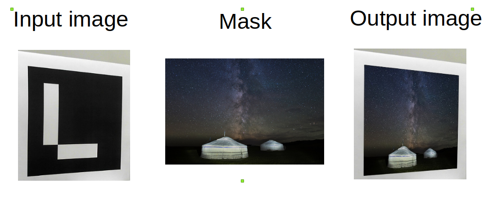

# Aruco
Simple python code for overlaying mask image over detected Aruco markers in real time.

<p align="center">
    
</p>

## Prerequisite
Python 3 with OpenCV package is required.

Install OpenCV and its contrib library with pip
```
pip3 install opencv-python
pip3 install opencv-contrib-python
```

## Running
Run without any arguments from terminal.
```
python3 aruco.py
```
Terminate the program by clicking q key on the OpenCV window.
